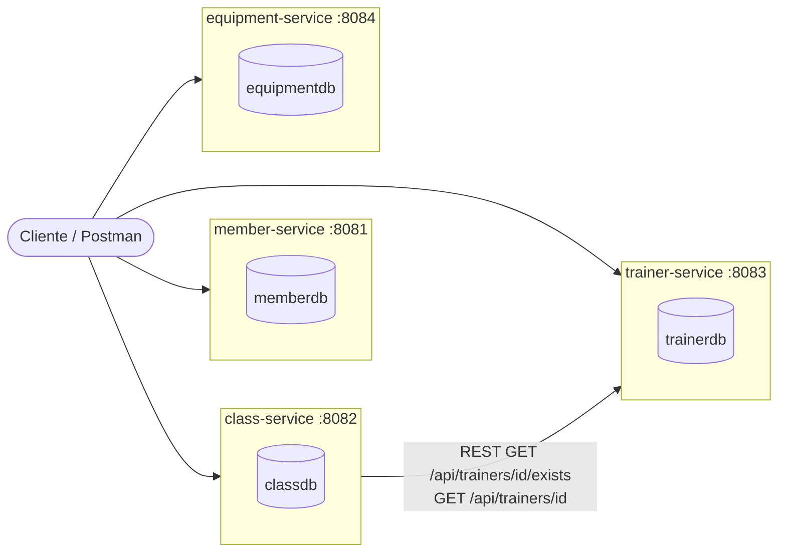

# Sistema de Gestión de un Gimnasio — Arquitectura de Microservicios

Refactorización del monolito [`monilito-gimnasio`](https://github.com/jrquinte/monilito-gimnasio) (Spring Boot + JPA)
hacia una arquitectura de **4 microservicios** independientes, aplicando **Domain-Driven Design (DDD)**.

---

## 1. Análisis del monolito original

El monolito tenía **una sola base de datos**, **4 entidades JPA** (`Miembro`, `Clase`, `Entrenador`, `Equipo`), un
único `GimnasioService` con toda la lógica y un único `GimnasioController` exponiendo todo bajo `/api/gimnasio/*`.

Relaciones encontradas:
- `Clase` → `Entrenador` (`@ManyToOne`): **única relación real entre entidades**.
- `Miembro` y `Equipo` no tienen relación con ninguna otra entidad.

Esto revela **4 posibles bounded contexts**, con **una única dependencia de negocio real**: *Scheduling* (Clases)
necesita saber que un *Coach* (Entrenador) existe. Membership (Miembros) e Inventory (Equipos) son completamente
autónomos y no tienen ninguna razón de dominio para acoplarse a nada más. Por eso se mantiene la división en 4
servicios (uno por bounded context), pero **solo se implementa comunicación REST donde existe una dependencia real**
(`class-service → trainer-service`), tal como pide el enunciado.

## 2. Bounded Contexts y microservicios



| Microservicio | Bounded Context | Responsabilidad | Entidad / Agregado raíz | BD |
|---|---|---|---|---|
| **member-service** | Membership | Alta y consulta de miembros del gimnasio | `Miembro` | `memberdb` (H2) |
| **class-service** | Scheduling | Programación de clases; valida y enriquece con datos del entrenador vía REST | `Clase` (con `entrenadorId` como referencia) | `classdb` (H2) |
| **trainer-service** | Coaching | Alta y consulta de entrenadores; expone endpoint de verificación de existencia | `Entrenador` | `trainerdb` (H2) |
| **equipment-service** | Inventory | Alta y consulta del inventario de equipos | `Equipo` | `equipmentdb` (H2) |

**Por qué no se comparten entidades JPA:** `class-service` **no tiene** la entidad `Entrenador`; solo guarda
`entrenadorId` (referencia por identidad) y, cuando se lee una clase, llama por REST a `trainer-service` para traer
`nombre`/`especialidad` y armar la respuesta. Si `trainer-service` no responde, `class-service` sigue funcionando y
simplemente devuelve la clase sin el detalle enriquecido del entrenador (degradación elegante), salvo al **crear**
una clase, donde si no se puede verificar el entrenador se rechaza la operación (regla de negocio).

## 3. Estructura DDD dentro de cada microservicio

```
src/main/java/co/analisys/<contexto>/
├── domain/
│   ├── model/        (entidades / aggregate root)
│   ├── repository/   (puertos de persistencia - Spring Data JPA)
│   └── service/       (reglas de negocio; en class-service también el puerto EntrenadorVerificationPort)
├── application/
│   ├── service/       (casos de uso, orquestación, mapeo entidad ↔ DTO)
│   └── dto/            (contratos públicos de la API)
└── infrastructure/
    ├── controller/    (REST controllers)
    ├── client/         (solo class-service: adaptador REST hacia trainer-service)
    ├── config/          (manejo global de errores, beans)
    └── exception/       (excepciones de dominio/infraestructura)
```

`class-service` aplica un patrón **puerto/adaptador (hexagonal)**: el dominio define `EntrenadorVerificationPort`
(interfaz) y la infraestructura lo implementa con `TrainerClient` (WebClient). Así el dominio no sabe que la
información viene por HTTP.

## 4. Comunicación REST entre microservicios

**Consumidor:** `class-service` (`TrainerClient`, usando `WebClient`)
**Proveedor:** `trainer-service`

| Uso | Endpoint proveedor | Cuándo se llama |
|---|---|---|
| Validar que el entrenador existe | `GET /api/trainers/{id}/exists` → `boolean` | Al programar una clase (`POST /api/classes`) |
| Enriquecer con datos del entrenador | `GET /api/trainers/{id}` → `EntrenadorDTO` | Al listar/consultar clases (`GET /api/classes`, `GET /api/classes/{id}`) |

Manejo de errores:
- Entrenador inexistente (`404` de trainer-service) → `class-service` responde `409 Conflict` al crear la clase.
- `trainer-service` caído/timeout al **crear** una clase → `class-service` responde `503 Service Unavailable`.
- `trainer-service` caído/timeout al **leer** clases → se degrada: la clase se devuelve igual, con `entrenador: null`.

La URL de `trainer-service` **no está hardcodeada**: se configura vía la propiedad `services.trainer-service.url`
(variable de entorno `TRAINER_SERVICE_URL`, con `http://localhost:8083` como valor por defecto).

## 5. Puertos y bases de datos

| Microservicio | Puerto | Base de datos H2 (en memoria) | Consola H2 |
|---|---|---|---|
| member-service | `8081` | `jdbc:h2:mem:memberdb` | `/h2-console` |
| class-service | `8082` | `jdbc:h2:mem:classdb` | `/h2-console` |
| trainer-service | `8083` | `jdbc:h2:mem:trainerdb` | `/h2-console` |
| equipment-service | `8084` | `jdbc:h2:mem:equipmentdb` | `/h2-console` |

Se conservan los puertos sugeridos en el taller. Cada base es independiente: no hay foreign keys ni joins entre
esquemas de distintos microservicios.

## 6. Funcionalidades del monolito → nuevos endpoints

| Funcionalidad original | Endpoint original | Microservicio | Nuevo endpoint |
|---|---|---|---|
| Registrar miembro | `POST /api/gimnasio/miembros` | member-service | `POST /api/members` |
| Listar miembros | `GET /api/gimnasio/miembros` | member-service | `GET /api/members` |
| Programar clase | `POST /api/gimnasio/clases` | class-service (+ REST a trainer-service) | `POST /api/classes` |
| Listar clases | `GET /api/gimnasio/clases` | class-service (+ REST a trainer-service) | `GET /api/classes` |
| Agregar entrenador | `POST /api/gimnasio/entrenadores` | trainer-service | `POST /api/trainers` |
| Listar entrenadores | `GET /api/gimnasio/entrenadores` | trainer-service | `GET /api/trainers` |
| Agregar equipo | `POST /api/gimnasio/equipos` | equipment-service | `POST /api/equipment` |
| Listar equipos | `GET /api/gimnasio/equipos` | equipment-service | `GET /api/equipment` |

Endpoints nuevos agregados (no rompen nada, son complementarios): `GET /api/{recurso}/{id}` en los 4 servicios, y
`GET /api/trainers/{id}/exists` (usado internamente por class-service).

## 7. Cómo ejecutar cada microservicio

Requisitos: Java 17+, Maven (o el wrapper `mvnw` incluido en cada carpeta).

```bash
# Terminal 1
cd trainer-service && ./mvnw spring-boot:run

# Terminal 2
cd member-service && ./mvnw spring-boot:run

# Terminal 3
cd equipment-service && ./mvnw spring-boot:run

# Terminal 4 (levantar de último: llama a trainer-service al crear clases)
cd class-service && ./mvnw spring-boot:run
```

Cada uno carga datos de ejemplo automáticamente (`DataLoader`), igual que el monolito original.

> Nota: como este entorno de generación no tenía acceso a Maven Central, el código no pudo compilarse aquí. Se
> revisó manualmente (paquetes, imports, llaves balanceadas, XML/YAML válidos); al ejecutar `./mvnw spring-boot:run`
> en un entorno con acceso a internet, Maven descargará las dependencias declaradas (Spring Boot 3.3.2, H2, Lombok,
> WebFlux para el cliente REST) y cada servicio debería levantar sin cambios adicionales.

## 8. Ejemplos de requests / responses

**Crear un entrenador**
```http
POST http://localhost:8083/api/trainers
Content-Type: application/json

{ "nombre": "Diana Torres", "especialidad": "CrossFit" }
```
```json
{ "id": 3, "nombre": "Diana Torres", "especialidad": "CrossFit" }
```

**Programar una clase (dispara la validación REST contra trainer-service)**
```http
POST http://localhost:8082/api/classes
Content-Type: application/json

{ "nombre": "CrossFit Nocturno", "horario": "2026-08-10T19:00:00", "capacidadMaxima": 12, "entrenadorId": 3 }
```
```json
{
  "id": 3,
  "nombre": "CrossFit Nocturno",
  "horario": "2026-08-10T19:00:00",
  "capacidadMaxima": 12,
  "entrenadorId": 3,
  "entrenador": { "id": 3, "nombre": "Diana Torres", "especialidad": "CrossFit" }
}
```

**Entrenador inexistente**
```http
POST http://localhost:8082/api/classes
{ "nombre": "Clase Fantasma", "horario": "2026-08-10T19:00:00", "capacidadMaxima": 5, "entrenadorId": 999 }
```
```json
{ "status": 409, "error": "Conflict", "message": "No se puede programar la clase: no existe un entrenador con id 999" }
```

## 9. Decisiones de diseño

1. **4 microservicios, uno por bounded context**, sin subdividir de más: Membership, Scheduling, Coaching, Inventory.
2. **Ninguna entidad JPA se comparte**: `class-service` reemplaza el `@ManyToOne` a `Entrenador` por un
   `entrenadorId` (Long) + un puerto de dominio (`EntrenadorVerificationPort`) resuelto por REST.
3. **REST solo donde hay dependencia real de negocio** (class-service → trainer-service); member-service y
   equipment-service no llaman a nadie porque no lo necesitan.
4. **Patrón puerto/adaptador** para la comunicación REST: el dominio no conoce HTTP ni WebClient.
5. **URLs configurables** (`services.trainer-service.url` / `TRAINER_SERVICE_URL`), no hardcodeadas.
6. **Degradación elegante en lectura, estricta en escritura**: evita que una caída de trainer-service tumbe la
   consulta de clases, pero sí protege la integridad al crear una clase nueva.