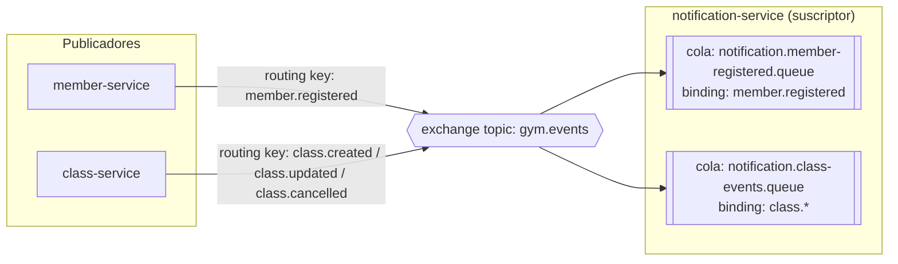

# Sistema de Gestión de un Gimnasio — Arquitectura de Microservicios

Refactorización del monolito [`monilito-gimnasio`](https://github.com/jrquinte/monilito-gimnasio) (Spring Boot + JPA)
hacia una arquitectura de **4 microservicios** independientes, aplicando **Domain-Driven Design (DDD)**.

---

## 1. Análisis del monolito original

El monolito tenía **una sola base de datos**, **4 entidades JPA** (`Miembro`, `Clase`, `Entrenador`, `Equipo`), un
único `GimnasioService` con toda la lógica y un único `GimnasioController` exponiendo todo bajo `/api/gimnasio/*`.

Relaciones encontradas:
- `Clase` → `Entrenador` (`@ManyToOne`): **única relación real entre entidades**.
- `Miembro` y `Equipo` no tienen relación con ninguna otra entidad.

Esto revela **4 posibles bounded contexts**, con **una única dependencia de negocio real**: *Scheduling* (Clases)
necesita saber que un *Coach* (Entrenador) existe. Membership (Miembros) e Inventory (Equipos) son completamente
autónomos y no tienen ninguna razón de dominio para acoplarse a nada más. Por eso se mantiene la división en 4
servicios (uno por bounded context), pero **solo se implementa comunicación REST donde existe una dependencia real**
(`class-service → trainer-service`), tal como pide el enunciado.

## 2. Bounded Contexts y microservicios

```mermaid
flowchart LR
    Client([Cliente / Postman])

    subgraph MS1[member-service :8081]
        M[(memberdb)]
    end
    subgraph MS2[class-service :8082]
        C[(classdb)]
    end
    subgraph MS3[trainer-service :8083]
        T[(trainerdb)]
    end
    subgraph MS4[equipment-service :8084]
        E[(equipmentdb)]
    end
    subgraph MS5[notification-service :8085]
        N[(notificationdb)]
    end
    MQ{{RabbitMQ<br/>exchange topic: gym.events}}

    Client --> MS1
    Client --> MS2
    Client --> MS3
    Client --> MS4
    Client -.consulta.-> MS5

    MS2 -->|REST GET /api/trainers/id/exists\nGET /api/trainers/id| MS3

    MS1 -.publica member.registered.-> MQ
    MS2 -.publica class.created/updated/cancelled.-> MQ
    MQ -.consume.-> MS5
```

| Microservicio | Bounded Context | Responsabilidad | Entidad / Agregado raíz | BD |
|---|---|---|---|---|
| **member-service** | Membership | Alta y consulta de miembros del gimnasio; publica `member.registered` | `Miembro` | `memberdb` (H2) |
| **class-service** | Scheduling | Programación/reprogramación/cancelación de clases; valida y enriquece con datos del entrenador vía REST; publica `class.created`/`class.updated`/`class.cancelled` | `Clase` (con `entrenadorId` como referencia) | `classdb` (H2) |
| **trainer-service** | Coaching | Alta y consulta de entrenadores; expone endpoint de verificación de existencia | `Entrenador` | `trainerdb` (H2) |
| **equipment-service** | Inventory | Alta y consulta del inventario de equipos | `Equipo` | `equipmentdb` (H2) |
| **notification-service** | Notifications | Suscriptor asíncrono de `gym.events`: procesa (simula el envío de) notificaciones de bienvenida a nuevos miembros y de cambios de horario | `Notificacion` | `notificationdb` (H2) |

**Por qué no se comparten entidades JPA:** `class-service` **no tiene** la entidad `Entrenador`; solo guarda
`entrenadorId` (referencia por identidad) y, cuando se lee una clase, llama por REST a `trainer-service` para traer
`nombre`/`especialidad` y armar la respuesta. Si `trainer-service` no responde, `class-service` sigue funcionando y
simplemente devuelve la clase sin el detalle enriquecido del entrenador (degradación elegante), salvo al **crear**
una clase, donde si no se puede verificar el entrenador se rechaza la operación (regla de negocio).

## 3. Estructura DDD dentro de cada microservicio

```
src/main/java/co/analisys/<contexto>/
├── domain/
│   ├── model/        (entidades / aggregate root)
│   ├── repository/   (puertos de persistencia - Spring Data JPA)
│   └── service/       (reglas de negocio; en class-service también el puerto EntrenadorVerificationPort)
├── application/
│   ├── service/       (casos de uso, orquestación, mapeo entidad ↔ DTO)
│   └── dto/            (contratos públicos de la API)
└── infrastructure/
    ├── controller/    (REST controllers)
    ├── client/         (solo class-service: adaptador REST hacia trainer-service)
    ├── config/          (manejo global de errores, beans)
    └── exception/       (excepciones de dominio/infraestructura)
```

`class-service` aplica un patrón **puerto/adaptador (hexagonal)**: el dominio define `EntrenadorVerificationPort`
(interfaz) y la infraestructura lo implementa con `TrainerClient` (WebClient). Así el dominio no sabe que la
información viene por HTTP.

## 4. Comunicación REST entre microservicios

**Consumidor:** `class-service` (`TrainerClient`, usando `WebClient`)
**Proveedor:** `trainer-service`

| Uso | Endpoint proveedor | Cuándo se llama |
|---|---|---|
| Validar que el entrenador existe | `GET /api/trainers/{id}/exists` → `boolean` | Al programar una clase (`POST /api/classes`) |
| Enriquecer con datos del entrenador | `GET /api/trainers/{id}` → `EntrenadorDTO` | Al listar/consultar clases (`GET /api/classes`, `GET /api/classes/{id}`) |

Manejo de errores:
- Entrenador inexistente (`404` de trainer-service) → `class-service` responde `409 Conflict` al crear la clase.
- `trainer-service` caído/timeout al **crear** una clase → `class-service` responde `503 Service Unavailable`.
- `trainer-service` caído/timeout al **leer** clases → se degrada: la clase se devuelve igual, con `entrenador: null`.

La URL de `trainer-service` **no está hardcodeada**: se configura vía la propiedad `services.trainer-service.url`
(variable de entorno `TRAINER_SERVICE_URL`, con `http://localhost:8083` como valor por defecto).

## 4bis. Mensajería asíncrona con RabbitMQ (pub/sub)

Además de la comunicación síncrona REST (`class-service → trainer-service`), el sistema usa **RabbitMQ** para
desacoplar dos flujos que no necesitan respuesta inmediata: notificar a un nuevo miembro y avisar de cambios de
horario. Se implementa como **publish/subscribe** con un único **exchange topic** (`gym.events`), en vez de colas
punto a punto: los publicadores no conocen a sus suscriptores, y se pueden agregar suscriptores nuevos sin tocar
member-service ni class-service.



**Quién declara qué:** los publicadores (`member-service`, `class-service`) solo declaran el exchange y publican en
él; **no** declaran colas. El suscriptor (`notification-service`) declara sus propias colas y sus bindings al mismo
exchange. Así, sumar un nuevo suscriptor (por ejemplo, un futuro `analytics-service`) es agregar una cola nueva en
ese servicio, sin desplegar de nuevo `member-service` ni `class-service`.

| Routing key | Publicador | Payload | Se dispara cuando... |
|---|---|---|---|
| `member.registered` | member-service | `MemberRegisteredEvent` (id, nombre, email, fechaInscripcion) | Se registra un miembro nuevo (`POST /api/members`) |
| `class.created` | class-service | `ClassScheduleEvent` (tipoEvento, id, nombre, horario, capacidadMaxima, entrenadorId) | Se programa una clase (`POST /api/classes`) |
| `class.updated` | class-service | `ClassScheduleEvent` | Se reprograma una clase (`PUT /api/classes/{id}`) |
| `class.cancelled` | class-service | `ClassScheduleEvent` | Se cancela una clase (`DELETE /api/classes/{id}`) |

**Sistema de notificación asíncrona de nuevos suscriptores:** al registrarse un miembro, `member-service` guarda el
registro y publica el evento; la respuesta HTTP no espera a que la notificación se procese. `notification-service`
consume el evento en su propio momento, simula el envío (lo loguea) y lo deja registrado en su base de datos,
consultable en `GET /api/notifications`.

**Patrón pub/sub para cambios de horario:** la cola de `notification-service` está enlazada con el wildcard
`class.*`, por lo que cualquier routing key nueva que empiece por `class.` llegaría a ella automáticamente. Esto
demuestra el patrón publish/subscribe: un publicador, múltiples suscriptores potenciales, ninguno acoplado al otro.

**Decisiones de diseño de la mensajería:**
- **JSON, sin JAR de dominio compartido:** cada microservicio define su propia copia (misma forma, distinto
  paquete) de los eventos que publica/consume. `notification-service` configura su
  `Jackson2JsonMessageConverter` con `TypePrecedence.INFERRED` para deserializar según el tipo del parámetro del
  `@RabbitListener`, ignorando el header `__TypeId__` (que referenciaría una clase que no existe en su classpath).
- **Exchange y credenciales configurables**, igual que `TRAINER_SERVICE_URL`: `GYM_EVENTS_EXCHANGE`,
  `RABBITMQ_HOST`, `RABBITMQ_PORT`, `RABBITMQ_USERNAME`, `RABBITMQ_PASSWORD` (por defecto `localhost:5672`,
  `guest`/`guest`).
- **Fire-and-forget real:** si `notification-service` está caído, `member-service` y `class-service` no fallan;
  RabbitMQ retiene los mensajes en la cola (son durables) hasta que el consumidor vuelva.

## 5. Puertos y bases de datos

| Microservicio | Puerto | Base de datos H2 (en memoria) | Consola H2 |
|---|---|---|---|
| member-service | `8081` | `jdbc:h2:mem:memberdb` | `/h2-console` |
| class-service | `8082` | `jdbc:h2:mem:classdb` | `/h2-console` |
| trainer-service | `8083` | `jdbc:h2:mem:trainerdb` | `/h2-console` |
| equipment-service | `8084` | `jdbc:h2:mem:equipmentdb` | `/h2-console` |
| notification-service | `8085` | `jdbc:h2:mem:notificationdb` | `/h2-console` |
| RabbitMQ | `5672` (AMQP) / `15672` (UI) | — | http://localhost:15672 (`guest`/`guest`) |

Se conservan los puertos sugeridos en el taller. Cada base es independiente: no hay foreign keys ni joins entre
esquemas de distintos microservicios.

## 6. Funcionalidades del monolito → nuevos endpoints

| Funcionalidad original | Endpoint original | Microservicio | Nuevo endpoint |
|---|---|---|---|
| Registrar miembro | `POST /api/gimnasio/miembros` | member-service | `POST /api/members` |
| Listar miembros | `GET /api/gimnasio/miembros` | member-service | `GET /api/members` |
| Programar clase | `POST /api/gimnasio/clases` | class-service (+ REST a trainer-service) | `POST /api/classes` |
| Listar clases | `GET /api/gimnasio/clases` | class-service (+ REST a trainer-service) | `GET /api/classes` |
| Agregar entrenador | `POST /api/gimnasio/entrenadores` | trainer-service | `POST /api/trainers` |
| Listar entrenadores | `GET /api/gimnasio/entrenadores` | trainer-service | `GET /api/trainers` |
| Agregar equipo | `POST /api/gimnasio/equipos` | equipment-service | `POST /api/equipment` |
| Listar equipos | `GET /api/gimnasio/equipos` | equipment-service | `GET /api/equipment` |

Endpoints nuevos agregados (no rompen nada, son complementarios): `GET /api/{recurso}/{id}` en los 4 servicios,
`GET /api/trainers/{id}/exists` (usado internamente por class-service), `PUT /api/classes/{id}` y
`DELETE /api/classes/{id}` (reprogramar/cancelar, ambos disparan eventos de pub/sub), y todo `notification-service`
(`GET /api/notifications`, `GET /api/notifications/{id}`), que no existía en el monolito.

## 7. Cómo ejecutar cada microservicio

Requisitos: Java 17+, Maven (o el wrapper `mvnw` incluido en cada carpeta), y Docker (para RabbitMQ).

```bash
# Terminal 0: levantar RabbitMQ (con UI de administración en :15672)
docker compose up -d

# Terminal 1
cd trainer-service && ./mvnw spring-boot:run

# Terminal 2
cd member-service && ./mvnw spring-boot:run

# Terminal 3
cd equipment-service && ./mvnw spring-boot:run

# Terminal 4 (llama a trainer-service al crear clases, y publica en RabbitMQ)
cd class-service && ./mvnw spring-boot:run

# Terminal 5 (consume los eventos de member-service y class-service)
cd notification-service && ./mvnw spring-boot:run
```

Cada uno carga datos de ejemplo automáticamente (`DataLoader`), igual que el monolito original.
`notification-service` no necesita `DataLoader`: su tabla se llena a medida que llegan eventos por RabbitMQ.

> Si RabbitMQ no está disponible cuando arrancan `member-service` o `class-service`, esos servicios igual levantan
> (Spring reintenta la conexión AMQP en segundo plano); simplemente no se publicará el evento hasta reconectar. Si
> `notification-service` no está corriendo, RabbitMQ retiene los mensajes en sus colas (son durables) hasta que
> vuelva a conectarse.

> Nota: como este entorno de generación no tenía acceso a Maven Central, el código no pudo compilarse aquí. Se
> revisó manualmente (paquetes, imports, llaves balanceadas, XML/YAML válidos); al ejecutar `./mvnw spring-boot:run`
> en un entorno con acceso a internet, Maven descargará las dependencias declaradas (Spring Boot 3.3.2, H2, Lombok,
> WebFlux para el cliente REST) y cada servicio debería levantar sin cambios adicionales.

## 8. Ejemplos de requests / responses

**Crear un entrenador**
```http
POST http://localhost:8083/api/trainers
Content-Type: application/json

{ "nombre": "Diana Torres", "especialidad": "CrossFit" }
```
```json
{ "id": 3, "nombre": "Diana Torres", "especialidad": "CrossFit" }
```

**Programar una clase (dispara la validación REST contra trainer-service)**
```http
POST http://localhost:8082/api/classes
Content-Type: application/json

{ "nombre": "CrossFit Nocturno", "horario": "2026-08-10T19:00:00", "capacidadMaxima": 12, "entrenadorId": 3 }
```
```json
{
  "id": 3,
  "nombre": "CrossFit Nocturno",
  "horario": "2026-08-10T19:00:00",
  "capacidadMaxima": 12,
  "entrenadorId": 3,
  "entrenador": { "id": 3, "nombre": "Diana Torres", "especialidad": "CrossFit" }
}
```

**Entrenador inexistente**
```http
POST http://localhost:8082/api/classes
{ "nombre": "Clase Fantasma", "horario": "2026-08-10T19:00:00", "capacidadMaxima": 5, "entrenadorId": 999 }
```
```json
{ "status": 409, "error": "Conflict", "message": "No se puede programar la clase: no existe un entrenador con id 999" }
```

**Reprogramar una clase (dispara `class.updated`)**
```http
PUT http://localhost:8082/api/classes/3
Content-Type: application/json

{ "nombre": "CrossFit Nocturno", "horario": "2026-08-10T20:00:00", "capacidadMaxima": 15, "entrenadorId": 3 }
```

**Cancelar una clase (dispara `class.cancelled`)**
```http
DELETE http://localhost:8082/api/classes/3
```
```http
HTTP/1.1 204 No Content
```

**Consultar las notificaciones procesadas por notification-service**
```http
GET http://localhost:8085/api/notifications
```
```json
[
  {
    "id": 1,
    "tipo": "BIENVENIDA_MIEMBRO",
    "destinatario": "juan@email.com",
    "mensaje": "¡Bienvenido/a Juan Pérez! Tu inscripción al gimnasio quedó registrada el 2026-09-14.",
    "origenEvento": "member.registered",
    "fechaEnvio": "2026-09-14T21:23:03.449519"
  }
]
```

## 9. Decisiones de diseño

1. **4+1 microservicios, uno por bounded context**, sin subdividir de más: Membership, Scheduling, Coaching,
   Inventory, y Notifications (el único que existe exclusivamente para consumir eventos, no expone casos de uso
   de negocio propios).
2. **Ninguna entidad JPA se comparte**: `class-service` reemplaza el `@ManyToOne` a `Entrenador` por un
   `entrenadorId` (Long) + un puerto de dominio (`EntrenadorVerificationPort`) resuelto por REST.
3. **REST solo donde hay dependencia real de negocio** (class-service → trainer-service); member-service y
   equipment-service no llaman a nadie porque no lo necesitan.
4. **Patrón puerto/adaptador** tanto para REST (`EntrenadorVerificationPort`) como para mensajería
   (`MemberEventPublisherPort`, `ClaseEventPublisherPort`): el dominio no conoce HTTP, WebClient, AMQP ni RabbitMQ.
5. **URLs y broker configurables** (`services.trainer-service.url`/`TRAINER_SERVICE_URL`,
   `GYM_EVENTS_EXCHANGE`, `RABBITMQ_*`), no hardcodeados.
6. **Degradación elegante en lectura, estricta en escritura (REST)**: evita que una caída de trainer-service tumbe
   la consulta de clases, pero sí protege la integridad al crear una clase nueva.
7. **Mensajería siempre best-effort**: a diferencia de la validación REST contra trainer-service (que sí bloquea
   la escritura), publicar en RabbitMQ nunca hace fallar una operación de negocio; si el broker no responde, se
   loguea una advertencia y la petición HTTP original sigue su curso normalmente.
8. **Pub/sub con un solo exchange topic, sin colas declaradas por el publicador**: `member-service` y
   `class-service` no saben ni les importa si `notification-service` (o un futuro suscriptor) está escuchando.